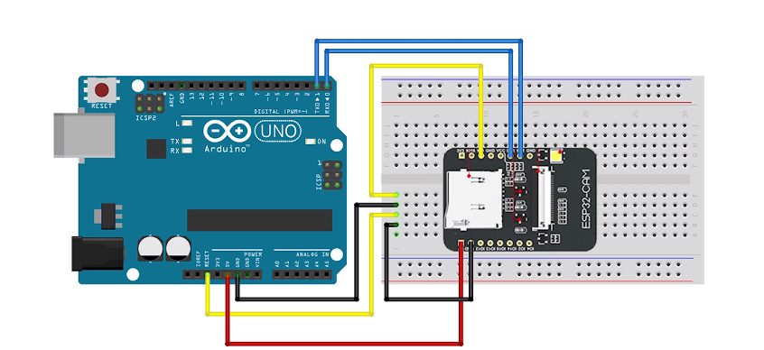
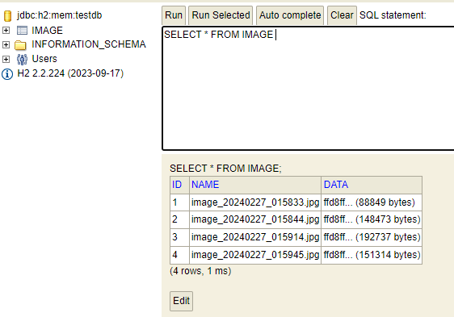
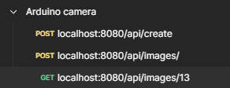

# HomeGuard: Smart Home Security System 

HomeGuard is a comprehensive smart security system designed for homes, integrating ESP32-CAM and Spring Boot for enhanced safety through live image surveillance and motion detection. This project aims to provide homeowners with a reliable, expandable security system that can monitor various environmental and security threats. 

<p align="center">
  
</p>

## Features

- **Live Image Capture:** Utilizes ESP32-CAM for capturing live images when motion is detected.
- **Motion Detection:** Alerts homeowners via the API when unexpected motion is observed.
- **Sound Triggered Captures:** Captures images when a significant sound is detected, adding another layer of security.
- **Email Notifications:** Sends immediate alerts to homeowners via email when motion or sound triggers an image capture, enhancing the security and awareness of the system.
- **Distance Measurement:** After capturing an image, the system estimates the distance of the detected object or person.
- **Expandable:** Planned upgrades include a React frontend for user-friendly access and additional sensors (fire, flood, temperature, humidity, air quality, carbon monoxide, and flammable gases) for comprehensive environmental monitoring.

## Getting Started

These instructions will help you get a copy of the project up and running on your local machine for development and testing purposes.

## Current Status and Workaround

Due to Tinkercad's current lack of support for the ESP32, I'm unable to provide an interactive simulation for this prototype. However, to ensure an accessible start and offer a clear visualization of the project setup, I've included photographs of the assembled prototype. Please understand that these images are a temporary solution. Despite the absence of a Tinkercad simulation, I believe these photographs will help beginners to take their first steps with the ESP32 more easily.



### Prerequisites

- ESP32-CAM module
- PIR Motion Sensor Module
- Ultrasonic Distance Sensor
- A computer with Arduino IDE installed
- Spring Boot environment setup
- Postman for API testing

### Running the Project

1. **Start the Spring Boot application:** Navigate to your Spring Boot project's root directory and run the application using your IDE or the command line.
2. **ESP32-CAM Configuration:** Upload the provided Arduino sketch to your ESP32-CAM. Adjust WiFi settings and API endpoints as necessary.
3. **Accessing the Live Feed:** With everything set up, access the live feed through your Spring Boot application's endpoints, detailed in the Postman workspace.

### Viewing the Database

To view the database and its contents:

1. **Access the H2 Database Console:** Once your application is running, you can access the H2 database console by navigating to `http://localhost:8080/h2-console` in your web browser. The exact URL may vary based on your application's configuration.

2. **Login to H2 Console:** Use the JDBC URL, username, and password as configured in your `application.properties` file to log in to the H2 console. 

    

### Accessing Photos with Postman

To view and interact with the live feed photos:



1. **Open Postman:** Start Postman on your computer.
2. **Import Workspace:** Import the Postman workspace provided with the project. This workspace contains pre-configured requests to interact with your Spring Boot application. [Workspace for Postman](https://github.com/berkaybarisalgun/HomeGuard--A-Smart-Home-Security-System-with-ESP32-CAM-and-Spring-Boot/blob/main/Arduino%20camera.postman_collection.json)
3. **Send Requests:** Use the requests in the Postman workspace to fetch live feed photos from the ESP32-CAM. You can view, save, or manipulate these photos as needed.

## Email Notifications

HomeGuard now has a feature that sends email alerts right away when it spots unexpected movement or sound. This new feature helps make your home safer by quickly telling you about possible dangers.

### Configuring Email Notifications

To enable email notifications, follow these steps:

1. **Update Application Properties:** Ensure your `application.properties` file includes the necessary SMTP settings for email transmission. Here's an example configuration for Gmail:
- spring.mail.host=smtp.gmail.com
- spring.mail.port=587
- spring.mail.username=yourEmail@gmail.com
- spring.mail.password=yourEmailPassword (Not your normal mail password. Please check App passwords in gmail.) [App Passwords in gmail](https://knowledge.workspace.google.com/kb/how-to-create-app-passwords-000009237)
- spring.mail.properties.mail.smtp.auth=true
- spring.mail.properties.mail.smtp.starttls.enable=true


## Configuring ESP32-CAM with Server URL

To ensure your ESP32-CAM successfully communicates with your Spring Boot application, you'll need to configure the `serverUrl` within the ESP32-CAM code to match your local network's IP address.

### Finding Your IP Address

1. Open Command Prompt (cmd) on your computer.
2. Type `ipconfig` and press Enter.
3. Look for the "IPv4 Address" under your active network connection. This is your local IP address.

### Finding Your IP Address on Mac

1. Open the terminal. You can find Terminal in the Applications folder under Utilities, or you can search for it using Spotlight.
2. In the Terminal, type the following command and press Enter: ifconfig
3. Search for the "inet" address listed under your active network connection. It will appear under `en0` if you're using Wi-Fi, or `en1` if you're using an Ethernet cable. This "inet" address is your local IP address.


### Updating serverUrl in ESP32-CAM

1. In the provided Arduino sketch for the ESP32-CAM, locate the `serverUrl` variable.
2. Replace the existing IP address with the IPv4 address you found using `ipconfig`.
const char* serverUrl = "http://192.168.x.x:8080/endpoint";


3. Upload the updated sketch to your ESP32-CAM module.

## Common Errors and Troubleshooting

If you're using HomeGuard, you might run into some issues. Here are some steps to fix a common error:

### Error Code [90149-224]
**Error Message:** "Database “/Users/<yourusername>/test” not found, either pre-create it or allow remote database creation (not recommended in secure environments) [90149-224]"


This error happens when the H2 database can't find the needed database file when starting. Here’s how to fix it:

1. **Find Your Username:**
   - Open Command Prompt (cmd) on Windows or Terminal on Mac.
   - Type `whoami` and press Enter.
   - Write down the username that shows up. This is your system username.

2. **Check for the Database File:**
   - Go to your user directory by typing `ls /Users/<yourusername>/` in Terminal or Command Prompt.
   - Look for a file named `test.mv.db`. If this file is missing, you need to create it.

3. **Create the Database File:**
   - In Terminal or Command Prompt, type:
     ```bash
     touch /Users/<yourusername>/test.mv.db
     ```
   - This command makes an empty file named `test.mv.db` that the H2 database can use.

Following these steps should help you solve the database not found error and keep using HomeGuard smoothly.


## Upcoming Features

I plan to enhance HomeGuard by integrating a React frontend for easier interaction and adding more sensors for a thorough home protection system.

## Contributions

As this project evolves, I'll be adding more photos and making continuous improvements. Your contributions and suggestions are welcome!

## Credits

This project was inspired by and built upon the knowledge from the following tutorials:
- [Getting Started with ESP32-CAM](https://lastminuteengineers.com/getting-started-with-esp32-cam/)
- [ESP32-CAM Access Point (AP) for Web Server](https://randomnerdtutorials.com/esp32-cam-access-point-ap-web-server/)
- [AutoConnect Library for ESP32-CAM](https://hieromon.github.io/AutoConnect/esp32cam.html)
- [Error Codes Reference](https://docs.espressif.com/projects/esp-idf/en/stable/esp32/api-reference/error-codes.html)
- [Enhanced feautres of ESP32-CAM](https://docs.micropython.org/en/latest/esp32/quickref.html)
